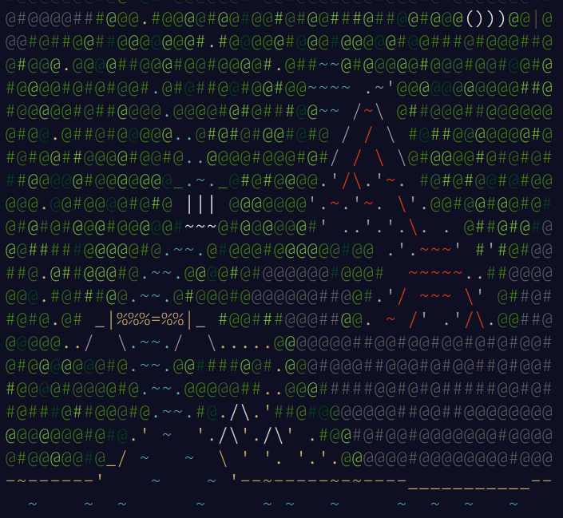

# AoC-2022-cplusplus

**Various 64-bit ARM SBC Run Times**

| Model | Core | Clock | Compiler |
| --- | --- | --- | --- |
| rock-5b | cortex-a76 | 2.4 GHz | g++ 10.2.1 |
| pi4b | cortex-a72 | 1.8 GHz | g++ 10.2.1 |
| rock-4se | cortex-a72 | 1.8GHz | g++ 10.4.0 |
| jetson nano | cortex-a57 | 1.5 GHz | g++ 10.3.0 |

| Day - Title | rock-5b | pi4b | rock-4se | jetson nano |
| --- | --- | --- | --- | --- |
| Day 1: Calorie Counting             | 0.309 ms.   | 0.435 ms.   | 0.464 ms.   | 0.438 ms.   |
| Day 2: Rock Paper Scisors           | 0.552 ms.   | 0.88 ms.    | 0.83 ms.    | 1.08 ms.    |
| Day 3: Rucksack Reorganization      | 0.261 ms.   | 0.312 ms.   | 0.372 ms.   | 0.333 ms.   |
| Day 4: Camp Cleanup                 | 0.544 ms.   | 0.866 ms.   | 0.897 ms.   | 1.0 ms.     |
| Day 5: Supply Stacks                | 0.455 ms.   | 0.761 ms.   | 0.849 ms.   | 0.93 ms.    |
| Day 6: Tuning Trouble               | 0.323 ms.   | 0.401 ms.   | 0.463 ms.   | 0.463 ms.   |
| Day 7: No Space Left On Device      | 0.375 ms.   | 0.51 ms.    | 0.533 ms.   | 0.52 ms.    |
| Day 8: Treetop Tree House           | 0.778 ms.   | 1.225 ms.   | 1.305 ms.   | 1.629 ms.   |
| Day 9: Rope Bridge                  | 3.483 ms.   | 5.635 ms.   | 5.549 ms.   | 7.641 ms.   |
| Day 10: Cathode-Ray Tube            | 0.229 ms.   | 0.23 ms.    | 0.314 ms.   | 0.211 ms.   |
| Day 11: Monkey in the Middle        | 36.738 ms.  | 55.339 ms.  | 61.389 ms.  | 78.153 ms.  |
| Day 12: Hill Climbing Algorithm     | 35.489 ms.  | 65.098 ms.  | 66.766 ms.  | 82.899 ms.  |
| Day 13: Distress Signal             | 6.897 ms.   | 13.004 ms.  | 11.874 ms.  | 13.278 ms.  |
| Day 14: Regolith Reservoir          | 380.329 ms. | 1091.58 ms. | 1048.55 ms. | 1601.42 ms. |
| Day 15: Beacon Exclusion Zone       | 801.112 ms. | 1507.05 ms. | 1830.17 ms. | 2153.38 ms. |
| Day 16: Proboscidea Volcanium       | 2953.65 ms. | 4174.57 ms. | 4236.22 ms. | 4017.29 ms. |
| Day 17: Pyroclastic Flow            | 123.51 ms.  | 250.337 ms. | 268.667 ms. | 330.211 ms. |
| Day 18: Boiling Boulders            | 13.949 ms.  | 25.851  ms. | 25.128 ms.  | 35.287 ms.  |
| Day 19: Not Enough Minerals         | 3866.72 ms. | 8678.45 ms. | 8817.36 ms. | 11595.2 ms. |
| Day 20: Grove Positioning System    | 368.592 ms. | 686.101 ms. | 677.441 ms. | 827.708 ms. |
| Day 21: Monkey Math                 | 5.388 ms.   | 10.421 ms.  | 10.36 ms.   | 12.609 ms.  |
| Day 22: Monkey Map                  | 5.955 ms.   | 9.938 ms.   | 9.286 ms.   | 11.513 ms.  |
