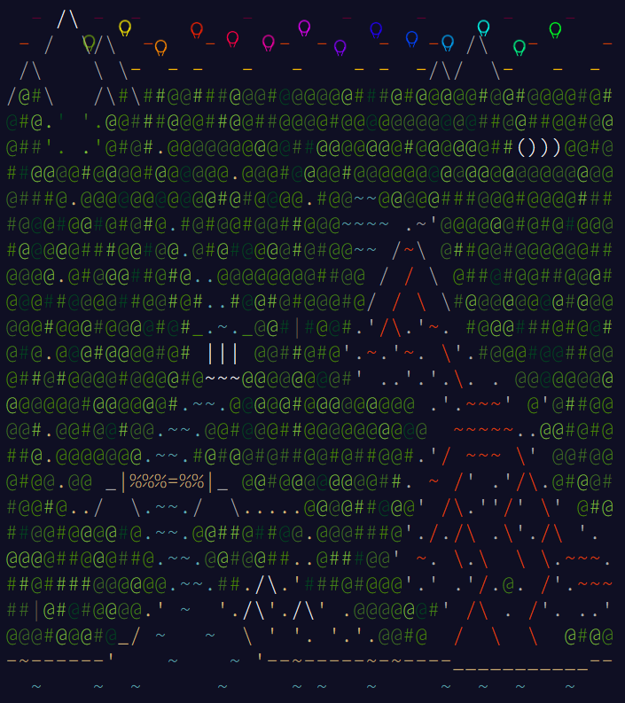

# AoC-2022-cplusplus

**Various 64-bit ARM SBC Run Times**

| Model | Core | Clock | Compiler |
| --- | --- | --- | --- |
| rock-5b | cortex-a76 | 2.4 GHz | g++ 10.2.1 |
| pi4b | cortex-a72 | 1.8 GHz | g++ 10.2.1 |
| rock-4se | cortex-a72 | 1.8GHz | g++ 10.4.0 |
| jetson nano | cortex-a57 | 1.5 GHz | g++ 10.3.0 |

| Day - Title | rock-5b | pi4b | rock-4se | jetson nano |
| --- | --- | --- | --- | --- |
| Day 1: Calorie Counting             | 0.32 ms.    | 0.42 ms.    | 0.469 ms.   | 0.443 ms.   |
| Day 2: Rock Paper Scisors           | 0.557 ms.   | 0.881 ms.   | 0.83 ms.    | 1.16 ms.    |
| Day 3: Rucksack Reorganization      | 0.267 ms.   | 0.317 ms.   | 0.37 ms.    | 0.339 ms.   |
| Day 4: Camp Cleanup                 | 0.553 ms.   | 0.853 ms.   | 0.895 ms.   | 1.001 ms.   |
| Day 5: Supply Stacks                | 0.463 ms.   | 0.789 ms.   | 0.84 ms.    | 0.94 ms.    |
| Day 6: Tuning Trouble               | 0.326 ms.   | 0.405 ms.   | 0.459 ms.   | 0.463 ms.   |
| Day 7: No Space Left On Device      | 0.382 ms.   | 0.526 ms.   | 0.528 ms.   | 0.525 ms.   |
| Day 8: Treetop Tree House           | 0.78 ms.    | 1.313 ms.   | 1.302 ms.   | 1.647 ms.   |
| Day 9: Rope Bridge                  | 3.482 ms.   | 5.834 ms.   | 5.554 ms.   | 7.701 ms.   |
| Day 10: Cathode-Ray Tube            | 0.237 ms.   | 0.432 ms.   | 0.313 ms.   | 0.209 ms.   |
| Day 11: Monkey in the Middle        | 36.672 ms.  | 57.789 ms.  | 61.534 ms.  | 78.21 ms.   |
| Day 12: Hill Climbing Algorithm     | 35.4 ms.    | 65.563 ms.  | 66.773 ms.  | 82.849 ms.  |
| Day 13: Distress Signal             | 6.953 ms.   | 13.338 ms.  | 11.95 ms.   | 13.285 ms.  |
| Day 14: Regolith Reservoir          | 379.633 ms. | 1096.14 ms. | 1048.25 ms. | 1609.74 ms. |
| Day 15: Beacon Exclusion Zone       | 804.528 ms. | 1509.13 ms. | 1797.53 ms. | 2153.27 ms. |
| Day 16: Proboscidea Volcanium       | 2709.24 ms. | 4271.71 ms. | 4232.9 ms.  | 4050.52 ms. |
| Day 17: Pyroclastic Flow            | 124.002 ms. | 246.848 ms. | 268.89 ms.  | 335.496 ms. |
| Day 18: Boiling Boulders            | 13.705 ms.  | 25.041  ms. | 25.083 ms.  | 34.401 ms.  |
| Day 19: Not Enough Minerals         | 3898.7 ms.  | 8678.36 ms. | 8860.22 ms. | 11592.1 ms. |
| Day 20: Grove Positioning System    | 371.212 ms. | 686.647 ms. | 676.249 ms. | 822.908 ms. |
| Day 21: Monkey Math                 | 5.388 ms.   | 10.341 ms.  | 10.332 ms.  | 12.879 ms.  |
| Day 22: Monkey Map                  | 5.227 ms.   | 8.91 ms.    | 9.517 ms.   | 10.546 ms.  |
| Day 23: Unstable Diffusion          | 1542.43 ms. | 3009.03 ms. | 3219.14 ms. | 4179.72 ms. |
| Day 24: Blizzard Basin              | 291.489 ms. | 485.095 ms. | 486.049 ms. | 658.942 ms. |
| Day 25: Full of Hot Air             | 0.199 ms.   | 0.274 ms.   | 0.217 ms.   | 0.154 ms.   |
